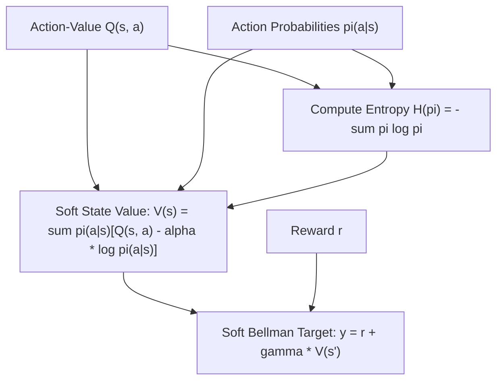

# genpark-sac-maximum-entropy-rl-evaluator-skill

Agent Skill implementing the **Soft Actor-Critic (SAC) Maximum Entropy Reinforcement Learning Formulation**, incentivizing policy exploration through Shannon entropy regularization.

## Architectural Overview

